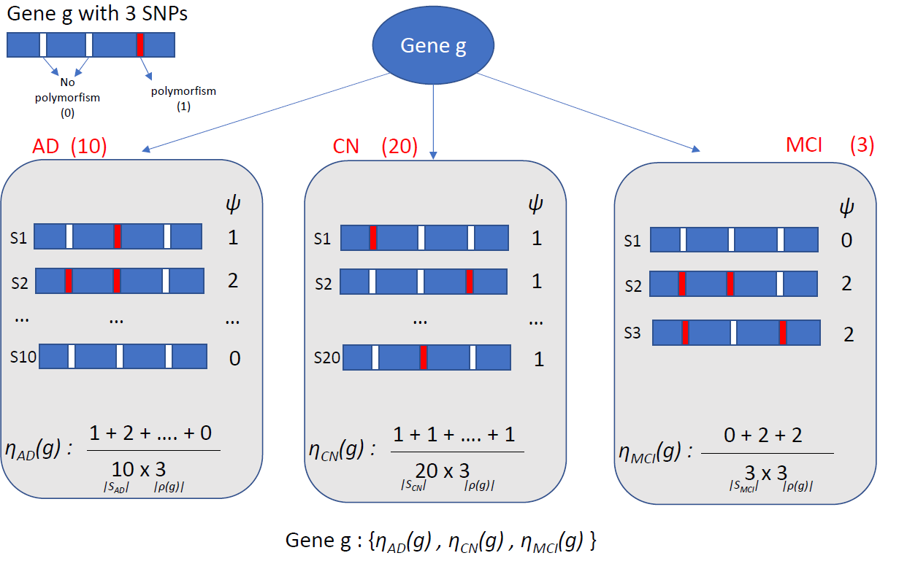

# DiGAS
A new methodology to prioritizes genes in relation to their capability of being biomarkers for a specific category, or for a group of two or more categories.

Here is showed a method illustration

The srs folder contains all code used:

* **SNPsMapping.R**: generate the table containing the associatoin between each gene a its SNPs
* **Pvalues_ADNI.ipynb**: Generalized allele specturm and Pvalues calculation on ADNI cohort
* **Pvalues_PPMI_swedd.ipynb**: Generalized allele specturm and Pvalues calculation on PPMI cohort
* **Classification_ADNI.ipynb**: classification method on ADNI cohort
* **Classification_PPMI_SWEDD.ipynb**: classification method on PPMI cohort

